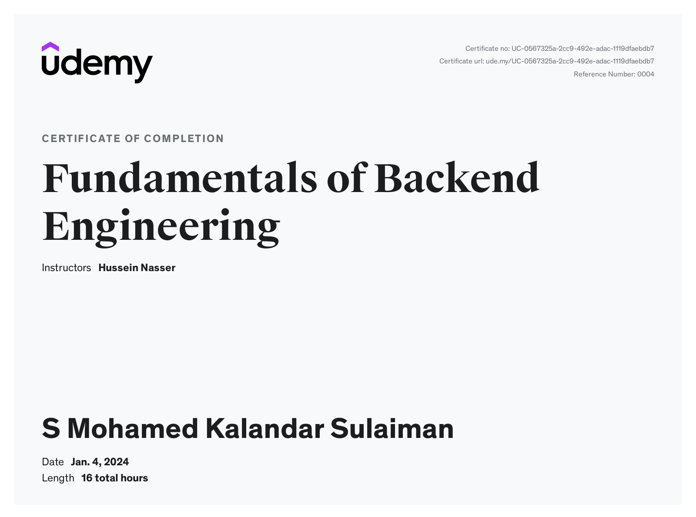
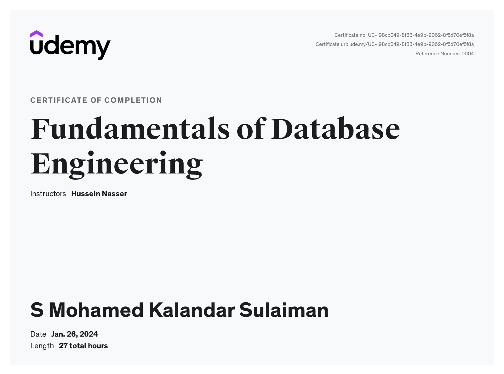
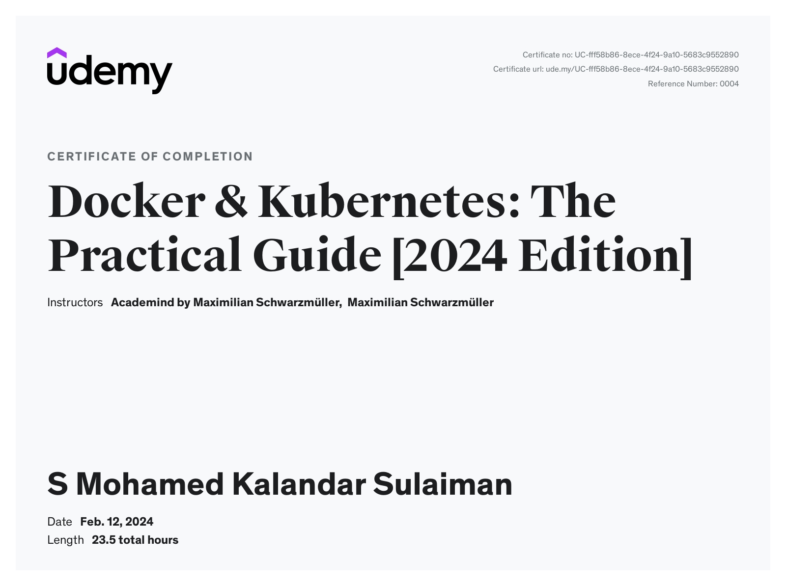
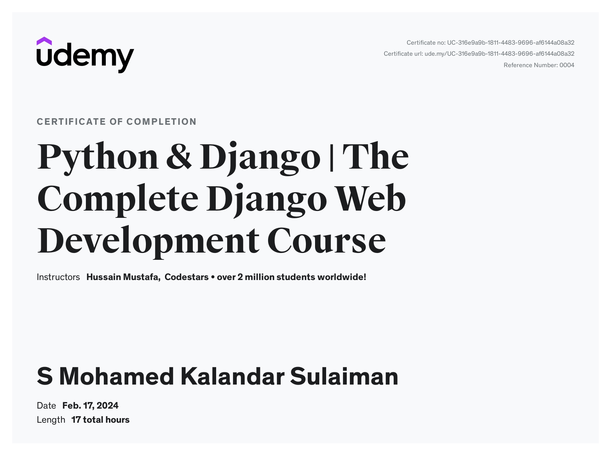
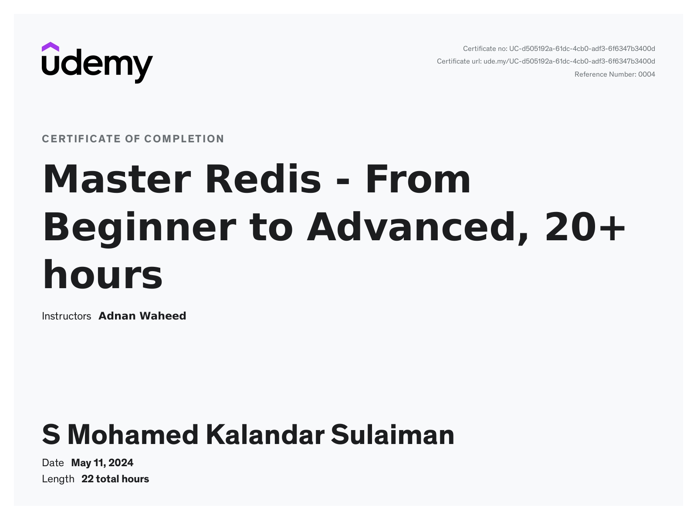
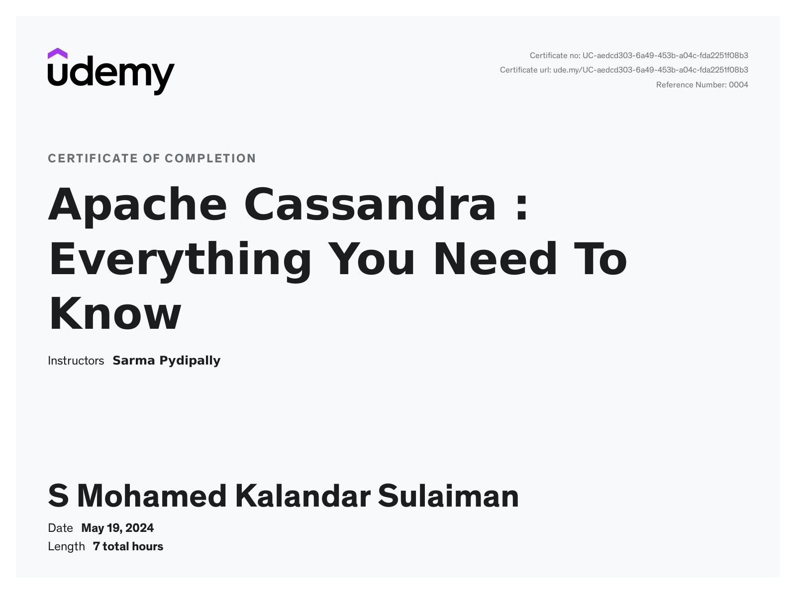
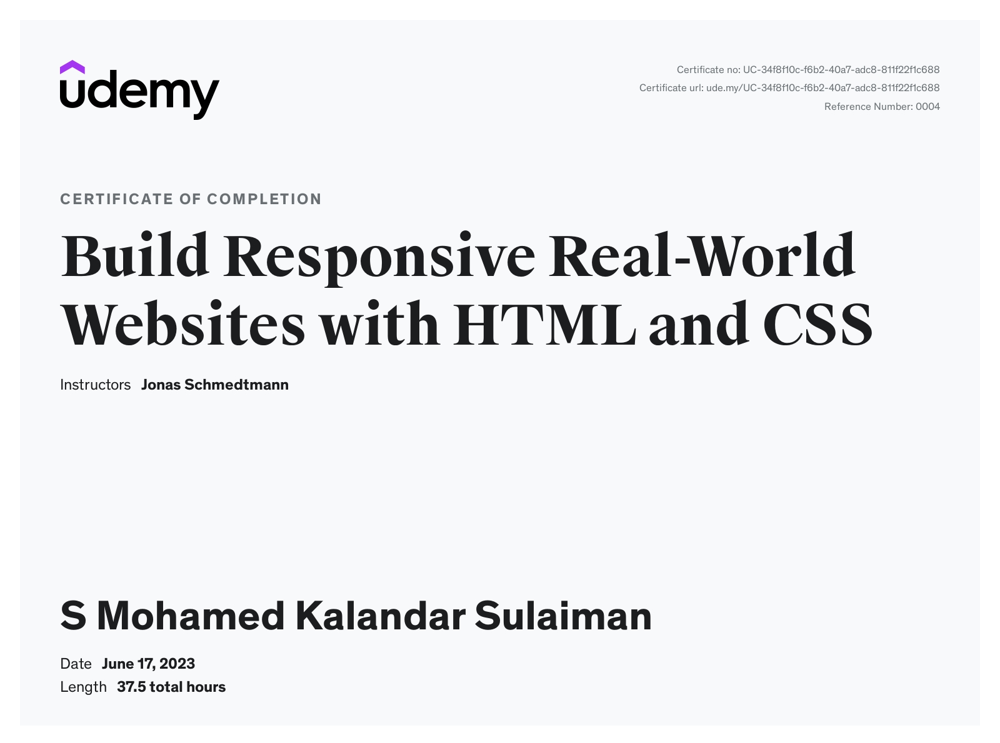

###Backend Developer

## Skills
### Technical Skills
- Git & Github
- REST API Design and
- Development
- AWS
- Docker
- Kubernetes basics
- Postman

### Knowledge Base
- High Level System Design
- Data Structures and Algorithms
- OAuth 2.0
- OOPs
- Design Patterns
- SOLID Principles
- Agile
- Asynchronous programming
- GRPC

### Frameworks
- Flask
- Django Rest Framework

### Areas of Interests
- Database Internals
- Distributed Systems
- Microservices

### Programming Languages
- Python
- SQL
- HTML, CSS , JavaScript

## Education
- B.E  (EEE)  Thiagarajar College of engineering  Apr’23  CGPA  : 8.99 
- HSC  (Computer Science Stream) SPIC School      Mar’19  Score : 554/600
- SSLC (Tamilnadu State Board ) SPIC School       Mar’17  Score : 488/500

## Work Experience
**Trimble , Chennai - Associate SDET ( July 2023 - Present )**
- Designed and developed a custom API automation testing framework
using python , along with UI using flask framework.
- Test scripts are triggered automatically via CICD pipeline and the
scripts are hosted in a serverless ECS fargate cluster
- Migrated existing test scripts from postman to the newly developed
automation framework.
- Tools used
    - Flask, Requests, HTML, CSS, Bootstrap 5, Docker, AWS Fargate

**Trimble , Chennai— Graduate Technical Intern ( Jan 2023 - June 2023 )**
- Worked on building REST API backend systems.
- Tech stack involved cloud native serverless backend system in AWS
with lambda and DynamoDB.

## Projects
**Bus Ticketing and Tracking System - April 2023 - Final Year Project**
- Python, Flask, SQlite, HTML, CSS, JS
- Raspberry Pi Pico , GPS Sensor , RFID module.

**Chat Application using Sockets - Feb 2022 - Hobby Project**
- Python , CLI, Socket

## Certifications
**AWS Certified Solutions Architect Associate - Dec'24**

**AWS Knowledge Cloud Essentials - Badge - Nov’23**

## Udemy Courses
**Fundamentals of Backend Engineering - Jan'24**

**Fundamentals of Backend Engineering - Jan'24**

**Udemy - Docker and Kubernetes - 2024 Practical Guide - Feb’24**

**Udemy -The Complete Django Web Development Course - Feb’24**

**Udemy - Master Redis - Beginner to Advanced, - May’24**

**Udemy - Apache Cassandra : Everything You Need To Know - May’24**

**HTML CSS**
[]
(https://www.udemy.com)

**Mongodb**

## Resume
[Download Resume](assets/resume.pdf)

[Blog](blogs/blog.md)