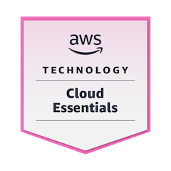
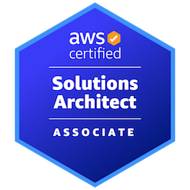

<h1 style="color:#546bff"><b>Backend Developer</b></h1>

Passionate software engineer with consistent efforts in learning new stuffs. Iam interested on working in distributed systems. I actively learn new technologies and apply in my work as well my personal projects. Primiarily a python devloper but would prefer to be language agnostic. Love backend engineering with essential front end skills . 

# Sections
- [Skills](#skills)
    - [Techincal Skills](#technical-skills)
    - [Knowledge base](#knowledge-base)
    - [Frameworks](#frameworks)
    - [Areas of Interests](#areas-of-interests)
    - [Programming Languages](#programming-languages)

- [Education](#education)
- [Work Experience](#work-experience)
- [Projects](#projects)
- [Certifications](#certifications)
- [Udemy Courses](#udemy-courses)
- [Contact](#contact)

# Skills
## Technical Skills
- Git & Github
- REST API Design and Development
- AWS
- Docker
- Kubernetes 
- Postman

## Knowledge Base
- High Level System Design
- Data Structures and Algorithms
- OAuth 2.0
- OOPS
- Design Patterns
- SOLID Principles
- Agile
- Asynchronous programming
- GRPC

## Frameworks
- Flask
- Django Rest Framework

## Areas of Interests
- Database Internals
- Distributed Systems
- Microservices

## Programming Languages
- Python
- SQL
- HTML, CSS , JavaScript

# Education
- B.E  (EEE)  Thiagarajar College of engineering  Apr’23  CGPA  : 8.99 
- HSC  (Computer Science Stream) SPIC School      Mar’19  Score : 554/600
- SSLC (Tamilnadu State Board ) SPIC School       Mar’17  Score : 488/500

# Work Experience

### **Trimble , Chennai - Associate SDET ( July 2023 - Present )**
- Designed and developed a custom API automation testing framework
using python , along with UI using flask framework.
- Test scripts are triggered automatically via CICD pipeline and the
scripts are hosted in a serverless ECS fargate cluster
- Migrated existing test scripts from postman to the newly developed
automation framework.
- Tools and Tecnologies used
    - Flask
    - Requests 
    - HTML CSS Bootstrap 5
    - Docker
    - AWS Fargate

### **Trimble , Chennai— Graduate Technical Intern ( Jan 2023 - June 2023 )**
- Worked on building REST API backend systems.
- Tech stack involved cloud native serverless backend system in AWS
with AWS lambda and AWS DynamoDB.

# Projects
### **URL Shortener - May 2024**
- Most popular system design question for which I had designed and devloped all the intriguing components and techniques.
- Implementation details 
    - Rate limiter using **GRPC** as microservice.
    - Backend API using **Django REST Framework**.
    - Frontend using basic HTML , CSS , JS in django.
    - **Redis** as cache
    - **MongoDb** for persistence of User Profiles and Shortened URL
    - **Cassandra** for persistence of usage analytics
    - **Nginx** for proxying.
    - Containerised as **docker** images 
    - **Kubernetes** for deployment
- [Project blog for more details ](sections/blogs/url_shortener.md)
- [GitHub Repo]()

### **Bus Ticketing and Tracking System - April 2023 - Final Year Project**
- Python, Flask, SQlite, HTML, CSS, JS
- Raspberry Pi Pico , GPS Sensor , RFID module.
- [GitHub]()

### **Chat Application using Sockets - Feb 2022 - Hobby Project**
- Python , CLI, Socket

# Certifications
### **AWS Certified Solutions Architect Associate - Dec'24**

### **AWS Knowledge Cloud Essentials - Badge - Nov’23**

## Udemy Courses
<!-- #### [Udemy Courses](sections/pages/udemy.md) -->
- **Udemy - Building Responsive World Websites with HTML CSS- June'23**
- **Fundamentals of Backend Engineering - Jan'24**
- **Fundamentals of Database Engineering - Jan'24**
- **Udemy - Docker and Kubernetes - 2024 Practical Guide - Feb’24**
- **Udemy - The Complete Django Web Development Course - Feb’24**
- **Udemy - Master Redis - Beginner to Advanced, - May’24**
- **Udemy - Apache Cassandra Introduction - May’24**
- **Mongodb - Python Developer**
- **Udemy - Introduction to Nginx - UpSkilling**
- **Udemy - Fundamentals of Networking - UpSkilling**
- **Udemy - Fundamentals of Operating System - UpSkilling**
- **Udemy - AWS Certified Developer Associate - UpSkilling**
- **Udemy - AWS Certified Database Specialisation - UpSkilling**

    

    

    

    

    

    

    

    

## Contact 

    
    
    
    

## Blogs

[Blog](blogs/blog.md)

# EXPERIMENTAL SECTIONS

<custom-tag style="background-color: #fcfffd; border-radius: 10px; padding: 5px 10px;">Your text here</custom-tag>
