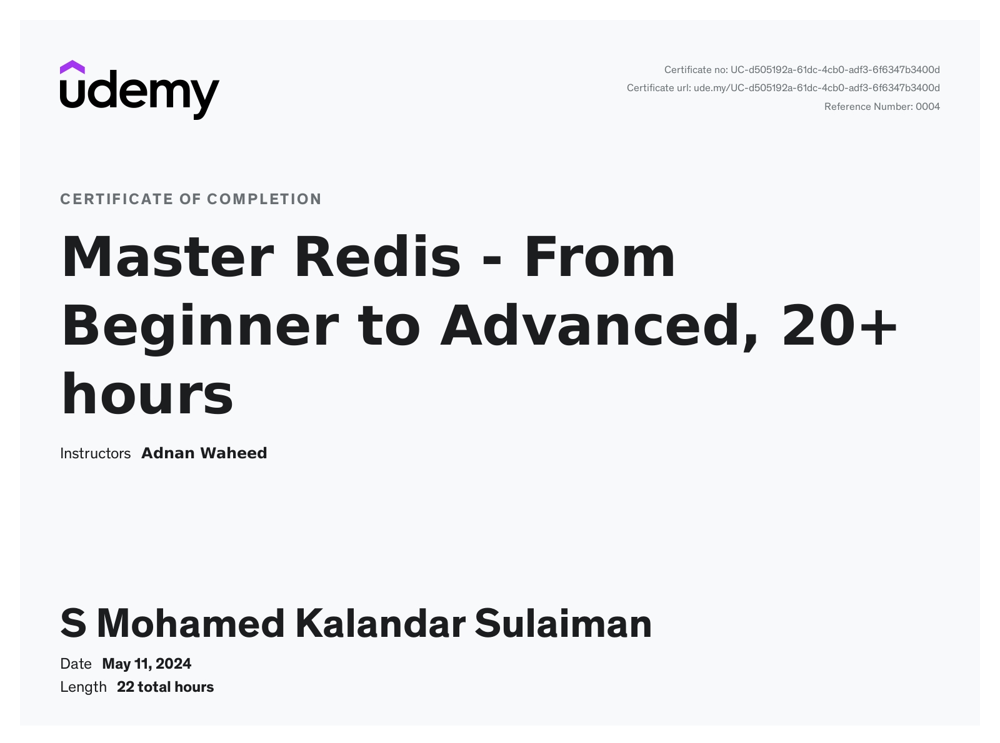

## Udemy Courses

**Fundamentals of Backend Engineering - Jan'24**

**Fundamentals of Backend Engineering - Jan'24**

**Udemy - Docker and Kubernetes - 2024 Practical Guide - Feb’24**

**Udemy -The Complete Django Web Development Course - Feb’24**

**Udemy - Master Redis - Beginner to Advanced, - May’24**

**Udemy - Apache Cassandra : Everything You Need To Know - May’24**

**HTML CSS**
[]
(https://www.udemy.com)

**Mongodb**

